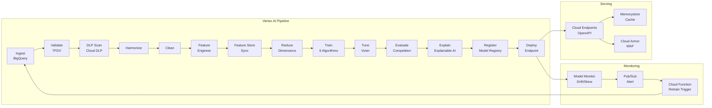

# Meridian

**GCP-native ML pipeline for student retention prediction.**

Meridian replaces the artisanal, AWS-centric [AMPE](https://github.com/deepily/ampe) framework with managed GCP services. It preserves AMPE's core design -- configuration-driven execution, multi-algorithm model competition, SMOTE class imbalance handling -- while wrapping every stage in Vertex AI Pipeline components backed by 23+ GCP products.

## Architecture



## Domain

Higher education student retention prediction. Synthetic data (50K students, 4 tables) mirrors the schema and distributions of real institutional data from AMPE's Redshift deployments. The target variable is `second_year_ret_flag` (binary: retained/not retained, 75/25 class imbalance).

## Quick Start

```bash
# Create virtual environment
python3 -m venv .venv
source .venv/bin/activate
pip install -r requirements.txt

# Generate synthetic data and load into BigQuery
make synth-data

# Run the full pipeline
make pipeline

# Run tests
make test

# Tear down expensive resources between sessions
make destroy-expensive
```

## GCP Products

| Category | Products |
|----------|----------|
| **ML Platform** | Vertex AI Pipelines, Experiments, Feature Store, Model Registry, Model Monitoring, TensorBoard, Vizier, Explainable AI, Prediction |
| **Data** | BigQuery, Cloud Storage (lifecycle + CMEK) |
| **Security** | Cloud KMS, Secret Manager, Cloud DLP, VPC Service Controls, Cloud Armor, IAP |
| **Observability** | Cloud Monitoring, Cloud Logging, Cloud Trace, Cloud Audit Logs |
| **Events** | Pub/Sub, Cloud Functions |
| **Networking** | VPC, Global Load Balancer, Cloud Endpoints |
| **Compute** | Cloud Build, Memorystore (Redis) |
| **IaC** | Terraform (8 modules) |

## FDE Competency Coverage

This project targets all 15 gap competencies from the [FDE gap analysis](../rnd/2026.03.31-fde-competency-product-gap-analysis.md):

- **3 CRITICAL**: AI Lifecycle Management, AI-Specific Security, Failure & Recovery Testing
- **12 MODERATE**: Observability, Data Protection, Compliance, Network Security, Availability, Graceful Degradation, Resource Efficiency, Config Management, API Design, Extensibility, Auth, API Docs
