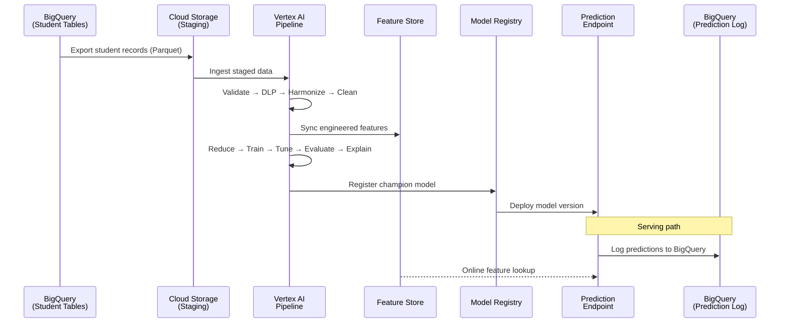
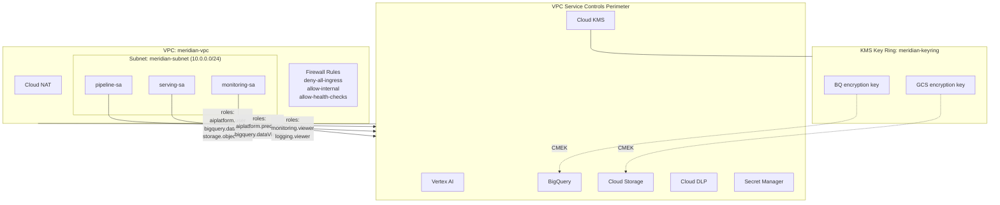
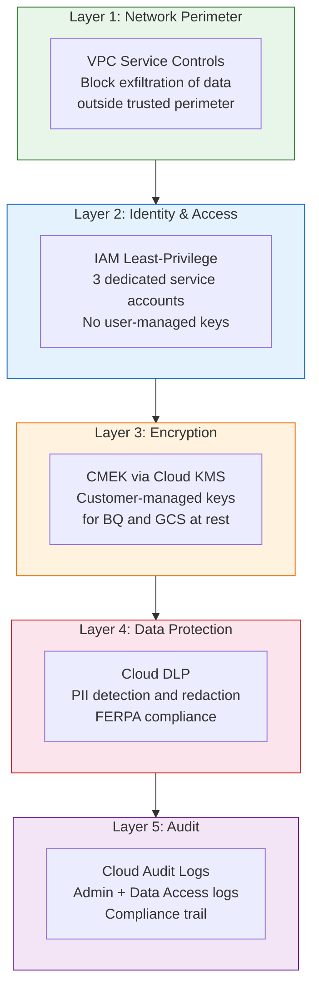
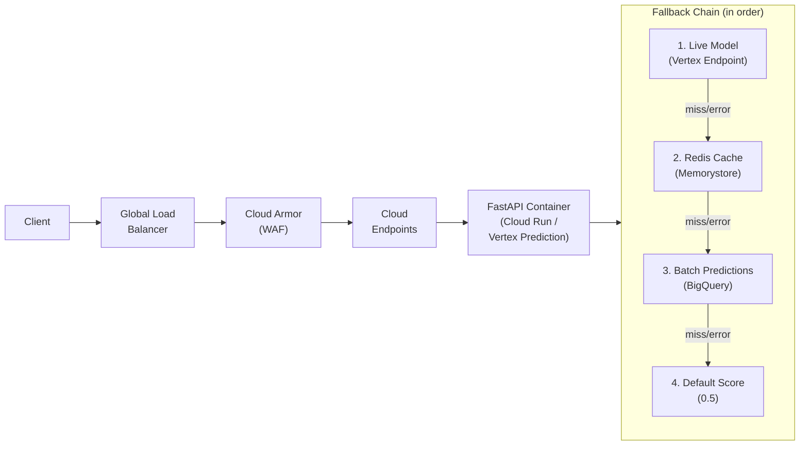
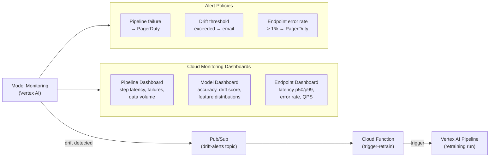

# Meridian System Architecture

Meridian is a GCP-native reimplementation of the AMPE (Abstracted Modeling and Prediction Engine) framework. It replaces AMPE's artisanal AWS-centric ML pipeline with managed GCP services for student retention/persistence prediction. The system covers 15 FDE competencies across 23+ GCP products.

---

## Pipeline DAG

The core ML pipeline consists of 14 KFP v2 components executed on Vertex AI Pipelines.

```mermaid
flowchart LR
    ingest["ingest"]
    validate["validate<br/>(TFDV)"]
    dlp_scan["dlp_scan"]
    harmonize["harmonize"]
    clean["clean"]
    feature_engineer["feature_engineer"]
    feature_store_sync["feature_store_sync"]
    reduce_dimensions["reduce_dimensions"]
    train["train"]
    tune["tune<br/>(Vizier)"]
    evaluate["evaluate"]
    explain["explain<br/>(Explainable AI)"]
    register["register"]
    deploy["deploy"]

    ingest -->|Parquet| validate
    validate -->|Parquet +<br/>anomaly report| dlp_scan
    dlp_scan -->|Parquet +<br/>DLP findings| harmonize
    harmonize -->|Parquet| clean
    clean -->|Parquet| feature_engineer
    feature_engineer -->|Parquet| feature_store_sync
    feature_store_sync -->|Feature vectors| reduce_dimensions
    reduce_dimensions -->|Reduced Parquet| train
    train -->|Model pickle +<br/>metrics| tune
    tune -->|Best model pickle| evaluate
    evaluate -->|Eval report| explain
    explain -->|SHAP values +<br/>feature attributions| register
    register -->|Model URI| deploy
```

---

## Data Flow

End-to-end data movement from source tables through prediction serving.

---

## Infrastructure Topology

VPC layout, service perimeter, service accounts, and encryption keys.

---

## Security Architecture

Five-layer defense-in-depth (per ADR 004).

---

## Serving Architecture

Request flow from client through the prediction endpoint, with fallback chain.

---

## Monitoring & Alerting

Drift detection triggers automatic retraining; three dashboards and three alert policies provide observability.

---

## GCP Products

| GCP Product | Role in Meridian | FDE Competency |
|---|---|---|
| Vertex AI Pipelines | Orchestrate 14-stage ML pipeline | ML Pipeline Orchestration |
| Vertex AI Experiments | Track training runs and metrics | Experiment Tracking |
| Vertex AI Feature Store | Online/offline feature serving | Feature Management |
| Vertex AI Model Registry | Model versioning and lineage | Model Management |
| Vertex AI Model Monitoring | Drift detection and alerts | Model Monitoring |
| Vertex AI TensorBoard | Training visualization | Experiment Tracking |
| Vertex AI Vizier | Hyperparameter tuning | AutoML / Tuning |
| Vertex AI Explainable AI | SHAP values, feature attributions | Model Explainability |
| Vertex AI Prediction | Online serving endpoint | Model Serving |
| BigQuery | Source data, prediction logs, analytics | Data Warehousing |
| Cloud Storage | Pipeline artifacts, staged data (Parquet) | Object Storage |
| Cloud KMS | CMEK for BQ and GCS encryption at rest | Encryption Management |
| Secret Manager | API keys, DB credentials | Secrets Management |
| Cloud DLP | PII detection/redaction (FERPA) | Data Protection |
| VPC Service Controls | Network perimeter around services | Network Security |
| Cloud Monitoring | Dashboards and metrics | Observability |
| Cloud Logging | Structured pipeline and serving logs | Observability |
| Cloud Trace | Request latency tracing | Observability |
| Cloud Armor | WAF rules on load balancer | Application Security |
| Memorystore (Redis) | Prediction cache (fallback layer 2) | Caching |
| Cloud Endpoints | API management and auth | API Management |
| Cloud Functions | Drift-to-retrain trigger | Event-Driven Compute |
| Pub/Sub | Drift alert message bus | Messaging |
| Cloud Build | CI/CD for pipeline and infrastructure | Build / Deploy |
| Cloud Audit Logs | Admin + data access compliance trail | Compliance |
| Cloud Run | FastAPI serving container | Serverless Compute |
| Terraform | Infrastructure as Code for all resources | IaC |
