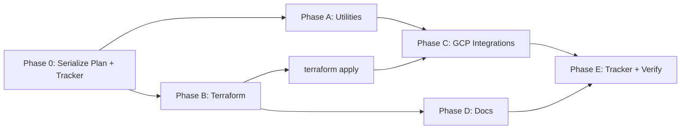

# Meridian Completion Plan: 13 Deferred Items + Utilities

**Date**: 2026-04-01
**Status**: Approved, implementation starting
**Serialized from**: `~/.claude/plans/gleaming-popping-cake.md`
**Companion tracker**: [2026.04.01-meridian-completion-tracker.md](2026.04.01-meridian-completion-tracker.md)
**Parent tracker**: [2026.04.01-meridian-implementation-tracker.md](2026.04.01-meridian-implementation-tracker.md)

---

## Context

Meridian is 80% complete (53/66 steps, 98 passing tests). All local-mode code works. The remaining 13 items were deferred because they required live GCP credentials, org-level permissions, or are documentation polish. GCP credentials are now available. Additionally, 3 planned utility files (`bq_client.py`, `gcs_client.py`, `secret_manager.py`) were never created, and the competency dashboard in the implementation tracker is stale (shows all 15 as "NOT STARTED").

### What's Deferred (13 items across 4 categories)

**Terraform Modules** (5 items):
- 2.10 — `infrastructure/modules/vertex/` (Feature Store, Model Registry, Endpoints)
- 4.12 — `infrastructure/modules/api/` (Cloud Endpoints, Cloud Armor, GLB)
- 4.13 — `infrastructure/modules/pubsub/` (Topics, Cloud Functions)
- 4.14 — `infrastructure/modules/monitoring/` (Dashboards, alerting)
- 4.15 — `monitoring/dashboards/retention_pipeline.json` (subsumed into 4.14)

**Live GCP Integrations** (5 items):
- 2.11 — Vertex AI Experiments integration
- 3.6 — TensorBoard integration
- 4.9 — OpenTelemetry / Cloud Trace
- 5.7 — Cloud Audit Logs verification
- 5.8 — VPC Service Controls (dry-run → enforced)

**Documentation Polish** (2 items):
- 5.9 — `docs/architecture.md`
- 5.10 — `docs/runbook.md`

**Not Applicable** (1 item):
- 3.9 — Gradient flow tests (sklearn trees, not neural nets)

---

## Execution Order & Dependencies

- **Phase 0 is first** — serialize plan and create tracker before any code
- **A and B are independent** — can be done in parallel after Phase 0
- **C depends on B** being applied (Vertex resources must exist)
- **D can start after B** (architecture is known)
- **E is final** — after everything else

---

## Phase A: Utility Extraction (prerequisite cleanup)

Extract inline GCP clients into reusable wrappers before expanding GCP surface area.

| Step | Action | Files |
|------|--------|-------|
| A.1 | Create BigQuery client wrapper | `src/utils/bq_client.py` (new) |
| A.2 | Create GCS client wrapper | `src/utils/gcs_client.py` (new) |
| A.3 | Create Secret Manager wrapper | `src/utils/secret_manager.py` (new) |
| A.4 | Update callers to use new wrappers | `src/pipeline/components/ingest.py`, `src/data_synthesis/load_to_bigquery.py` |

**Verification**: `pytest tests/ -v` — must remain 98+ passing.

---

## Phase B: Terraform Modules (4 new modules)

All follow the existing 3-file pattern (`main.tf`, `variables.tf`, `outputs.tf`). Naming: `meridian-{purpose}-{environment}`. Existing SAs from security module: `pipeline-sa`, `serving-sa`, `monitoring-sa`.

### B.1 — `infrastructure/modules/vertex/` (tracker item 2.10)

Resources:
- `google_vertex_ai_featurestore.meridian` — online store, CMEK
- `google_vertex_ai_featurestore_entitytype.student` + `.course`
- `google_vertex_ai_tensorboard.meridian` — for item 3.6
- `google_vertex_ai_endpoint.prediction` — for deploy component

Outputs: `featurestore_id`, `tensorboard_id`, `prediction_endpoint_id`

### B.2 — `infrastructure/modules/pubsub/` (tracker item 4.13)

Resources:
- `google_pubsub_topic.drift_alerts` + `.retrain_trigger`
- `google_pubsub_subscription` for each topic
- `google_cloudfunctions2_function.drift_alert` + `.retrain` — deploys the trigger functions from `src/pipeline/triggers/`
- Source zip upload to GCS

Outputs: `drift_alerts_topic_id`, `retrain_trigger_topic_id`, function URLs

### B.3 — `infrastructure/modules/monitoring/` (tracker item 4.14)

Resources:
- 3 dashboards: pipeline latency, model drift, endpoint health
- 3 alert policies: drift threshold (JS divergence > 0.1), endpoint 5xx rate, pipeline failure
- Notification channel (email) + uptime check

Outputs: dashboard IDs, alert policy IDs

### B.4 — `infrastructure/modules/api/` (tracker item 4.12)

Resources:
- `google_compute_global_address`, health check (`:8080/health`), backend service
- URL map, HTTPS proxy, managed SSL cert, forwarding rule
- `google_compute_security_policy.waf` — Cloud Armor OWASP rules + rate limiting

Outputs: `global_ip_address`, `load_balancer_url`, `cloud_armor_policy_id`

### B.5 — Environment files

- Update `infrastructure/environments/dev.tfvars` with new module variables
- Create `infrastructure/environments/staging.tfvars`

**Verification**: `terraform validate` per module, `terraform plan -var-file=dev.tfvars`.

---

## Phase C: Live GCP Integrations (11 steps)

Depends on Phase B modules being applied via `terraform apply`.

| Step | Item | File(s) | Work |
|------|------|---------|------|
| C.1 | 2.11 — Vertex AI Experiments | `src/pipeline/components/evaluate.py` | Complete `_log_to_vertex_experiments()` (~line 189): add experiment get-or-create, timestamp run names, artifact linking, try/except fallback |
| C.2 | 3.6 — TensorBoard | `src/pipeline/components/train.py` | Add `use_tensorboard` param, write TB logs per algorithm, `aiplatform.start_upload_tb_log()` for GCP mode |
| C.3 | 4.9 — OpenTelemetry | `src/monitoring/telemetry.py` (new), `src/utils/logging_config.py` | Init OTel SDK with GCP trace + monitoring exporters (deps already in requirements.txt), `@traced` decorator, wire into logging |
| C.4 | Cloud Function triggers | `src/pipeline/triggers/retrain_function/main.py`, `drift_alert_function/main.py` | Replace log-only stubs with `aiplatform.PipelineJob.create()` + `.submit()` |
| C.5 | Vizier integration | `src/pipeline/components/tune.py` | Replace fallback at line 237 with real Vizier study creation, trial loop, score reporting |
| C.6 | Vertex Deploy | `src/pipeline/components/deploy.py` | Complete `_deploy_to_vertex()`: custom container URI, traffic splitting dict, canary support |
| C.7 | Vertex Register | `src/pipeline/components/register.py` | Add version_aliases, lineage linking, is_default_version to `_register_to_vertex()` |
| C.8 | Vertex Explainable AI | `src/pipeline/components/explain.py` | Create `_explain_with_vertex_xai()`: call `endpoint.explain()` with Sampled Shapley, parse attributions |
| C.9 | Cloud DLP de-identify | `src/pipeline/components/dlp_scan.py` | Add `client.deidentify_content()` using security module's deidentify template |
| C.10 | 5.8 — VPC Service Controls | `infrastructure/modules/networking/vpc_sc.tf`, `variables.tf` | Uncomment resources, wrap in `count = var.enable_vpc_sc ? 1 : 0`, add `organization_id` variable |
| C.11 | 5.7 — Audit Logs verification | `tests/integration/test_audit_logs.py` (new) | Query Cloud Audit Logs for BQ/GCS/Vertex operations, assert expected entries exist |

**Verification**: Full test suite stays green. Each GCP integration tested with live credentials (`use_vertex_*=True` flags). New integration test for audit logs.

---

## Phase D: Documentation Polish (4 files)

| Step | Item | File | Content |
|------|------|------|---------|
| D.1 | 5.9 | `docs/architecture.md` | Mermaid diagrams: pipeline DAG (14 stages), data flow (BQ→GCS→Pipeline→FeatureStore→Endpoint), infra topology (VPC/NAT/VPC-SC), serving architecture (GLB→Armor→Endpoints→FastAPI→Cache→Fallback) |
| D.2 | 5.10 | `docs/runbook.md` | Sections: deployment sequence, monitoring dashboards, incident playbooks (drift/endpoint/pipeline), cost management (`make destroy-expensive`), troubleshooting |
| D.3 | — | `docs/model-card.md` | Standalone rendered version from `register.py` `_generate_model_card_metadata()` output |
| D.4 | — | `docs/api-spec.yaml` | Export OpenAPI spec from FastAPI app, save as static YAML |

---

## Phase E: Tracker Update + Final Verification

1. Update all 13 DEFERRED items → DONE in `rnd/2026.04.01-meridian-implementation-tracker.md`
2. Fix the stale Competency Progress Dashboard (all 15 currently show "NOT STARTED" — update to reflect actual state)
3. `pytest tests/ -v` — target 98+ tests passing
4. `terraform validate` on all 8 modules
5. `terraform plan -var-file=dev.tfvars` — clean plan
6. Commit all changes

---

## Estimated Scope

| Phase | New Files | Modified Files | Effort |
|-------|-----------|---------------|--------|
| 0 — Serialize Plan + Tracker | 2 | 0 | ~15 min |
| A — Utilities | 3 | 2 | ~30 min |
| B — Terraform | 14 (.tf + .tfvars) | 1 (dev.tfvars) | ~3 hrs |
| C — GCP Live | 2 new | 10 existing | ~5 hrs |
| D — Docs | 4 | 0 | ~2 hrs |
| E — Tracker | 0 | 1 | ~30 min |
| **Total** | **~23** | **~14** | **~11 hrs** |
