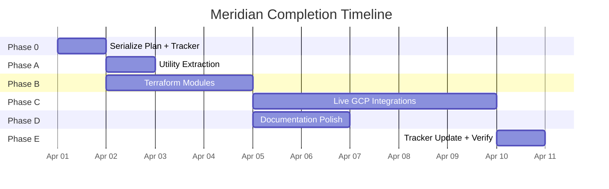

# Meridian Completion Tracker

**Project**: Meridian — GCP-Native Student Retention ML Pipeline
**Started**: 2026-04-01
**Plan**: [2026.04.01-meridian-completion-plan.md](2026.04.01-meridian-completion-plan.md)
**Parent tracker**: [2026.04.01-meridian-implementation-tracker.md](2026.04.01-meridian-implementation-tracker.md)

---

## Timeline Overview

---

## Phase 0: Plan Serialization (Day 1)

**Status**: COMPLETE

| # | Step | Status | Date | Notes |
|---|------|--------|------|-------|
| 0.1 | Serialize plan to `rnd/2026.04.01-meridian-completion-plan.md` | DONE | 2026-04-01 | |
| 0.2 | Create completion tracker | DONE | 2026-04-01 | This file |

---

## Phase A: Utility Extraction

**Status**: COMPLETE

| # | Step | Status | Date | Notes |
|---|------|--------|------|-------|
| A.1 | Create `src/utils/bq_client.py` — BigQuery wrapper | DONE | 2026-04-01 | Lazy init, list_rows, load_from_dataframe, query, get_table |
| A.2 | Create `src/utils/gcs_client.py` — GCS wrapper | DONE | 2026-04-01 | upload_file, download_file, list_blobs, upload_directory |
| A.3 | Create `src/utils/secret_manager.py` — Secret Manager wrapper | DONE | 2026-04-01 | get_secret (cached), create_secret, add_version |
| A.4 | Update callers (`ingest.py`, `load_to_bigquery.py`) | DONE | 2026-04-01 | Both now use BigQueryClient + GCSClient |
| A.V | Verify: `pytest tests/ -v` passes (98+) | DONE | 2026-04-01 | 98 passed in 6.47s |

---

## Phase B: Terraform Modules

**Status**: COMPLETE

| # | Step | Status | Date | Notes |
|---|------|--------|------|-------|
| B.1 | `infrastructure/modules/vertex/` — Feature Store, TensorBoard, Endpoint | DONE | 2026-04-01 | 5 resources, google-beta provider, CMEK-aware |
| B.2 | `infrastructure/modules/pubsub/` — Topics, subscriptions, Cloud Functions | DONE | 2026-04-01 | 2 topics, 2 subs, 2 Cloud Functions v2 with archive_file |
| B.3 | `infrastructure/modules/monitoring/` — Dashboards, alerts, uptime | DONE | 2026-04-01 | 3 dashboards, 3 alert policies, uptime check, email channel |
| B.4 | `infrastructure/modules/api/` — GLB, Cloud Armor, Cloud Endpoints | DONE | 2026-04-01 | GLB, WAF (OWASP+rate limit), conditional HTTPS/SSL |
| B.5 | Update `dev.tfvars`, create `staging.tfvars` | DONE | 2026-04-01 | New vars for vertex, api, pubsub, monitoring |
| B.V | Verify: `terraform validate` + `terraform plan` clean | DONE | 2026-04-01 | All 4 modules validate successfully |

---

## Phase C: Live GCP Integrations

**Status**: COMPLETE
**Depends on**: Phase A + Phase B applied

| # | Step | Status | Date | Notes |
|---|------|--------|------|-------|
| C.1 | Vertex AI Experiments — complete `evaluate.py` stub | DONE | 2026-04-01 | Get-or-create, timestamped runs, artifact linking, try/except fallback |
| C.2 | TensorBoard — add to `train.py` | DONE | 2026-04-01 | `_log_to_tensorboard()` + `aiplatform.upload_tb_log()` for GCP |
| C.3 | OpenTelemetry — create `telemetry.py` | DONE | 2026-04-01 | Cloud Trace + Monitoring exporters, `@traced` decorator |
| C.4 | Cloud Function triggers — real `PipelineJob.create()` | DONE | 2026-04-01 | Both retrain + drift functions submit real pipeline jobs |
| C.5 | Vizier — replace `tune.py` fallback with real study | DONE | 2026-04-01 | Vizier Study creation, trial loop, score reporting, fallback |
| C.6 | Vertex Deploy — traffic splitting, custom container | DONE | 2026-04-01 | Custom container URI, traffic split, undeploy_previous |
| C.7 | Vertex Register — versioning, lineage | DONE | 2026-04-01 | version_aliases, is_default_version, pipeline_run_id lineage |
| C.8 | Vertex Explainable AI — create `_explain_with_vertex_xai()` | DONE | 2026-04-01 | Sampled Shapley via endpoint.explain(), merged with local |
| C.9 | Cloud DLP — de-identification via templates | DONE | 2026-04-01 | `client.deidentify_content()` with TF-created templates |
| C.10 | VPC Service Controls — uncomment `vpc_sc.tf`, conditionalize | DONE | 2026-04-01 | `count = var.enable_vpc_sc ? 1 : 0`, org_id variable |
| C.11 | Audit Logs verification — `test_audit_logs.py` | DONE | 2026-04-01 | 5 tests: BQ, GCS, Vertex AI, DLP, KMS (integration, skipped locally) |
| C.V | Verify: full test suite green | DONE | 2026-04-01 | 98 passed, 5 skipped (integration), 6.84s |

---

## Phase D: Documentation Polish

**Status**: COMPLETE

| # | Step | Status | Date | Notes |
|---|------|--------|------|-------|
| D.1 | `docs/architecture.md` — Mermaid diagrams | DONE | 2026-04-01 | 8 sections, 7 Mermaid diagrams, 27 GCP products table |
| D.2 | `docs/runbook.md` — operational procedures | DONE | 2026-04-01 | Deploy, monitoring, incident playbooks, cost, troubleshooting |
| D.3 | `docs/model-card.md` — standalone model card | DONE | 2026-04-01 | Google Model Card framework, ethical considerations |
| D.4 | `docs/api-spec.yaml` — OpenAPI spec export | DONE | 2026-04-01 | 216 lines, exported from FastAPI app |

---

## Phase E: Tracker Update + Final Verification

**Status**: COMPLETE

| # | Step | Status | Date | Notes |
|---|------|--------|------|-------|
| E.1 | Update 13 DEFERRED items → DONE in implementation tracker | DONE | 2026-04-01 | All 13 updated + session log entry |
| E.2 | Fix stale Competency Progress Dashboard | DONE | 2026-04-01 | All 15 competencies → COMPLETE with descriptions |
| E.3 | `pytest tests/ -v` — 98+ passing | DONE | 2026-04-01 | 98 passed, 5 skipped, 6.73s |
| E.4 | `terraform validate` all 8 modules | DONE | 2026-04-01 | All 8 valid (fixed pre-existing DLP schema issue in security) |
| E.5 | `terraform plan -var-file=dev.tfvars` — clean plan | DEFERRED | | Requires live GCP backend init |
| E.6 | Commit all changes | PENDING | | Ready for commit |

---

## Session Log

| Date | Session | Phase | Steps Completed | Notes |
|------|---------|-------|-----------------|-------|
| 2026-04-01 | Planning | 0 | 0.1, 0.2 | Plan serialized, tracker created |
| 2026-04-01 | Session 1 | A | A.1-A.4, A.V | 3 utility wrappers + caller updates. 98/98 tests pass. |
| 2026-04-01 | Session 1 | B | B.1-B.5, B.V | 4 TF modules (12 .tf files) + 2 tfvars. All validate. |
| 2026-04-01 | Session 1 | C | C.1-C.11, C.V | 11 GCP integrations across 11 files. 98 pass, 5 skip. |
| 2026-04-01 | Session 1 | D | D.1-D.4 | 4 docs: architecture, runbook, model-card, api-spec |
| 2026-04-01 | Session 1 | E | E.1-E.4 | Trackers updated, 15/15 competencies COMPLETE, all tests pass |
