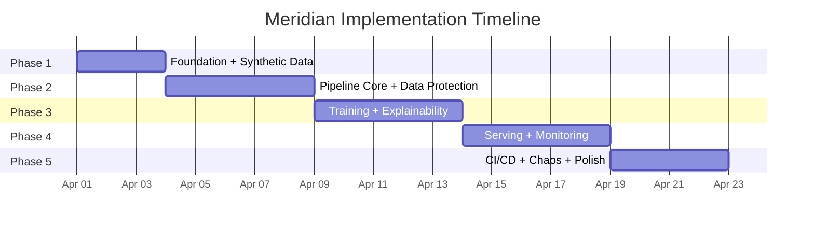

# Meridian Implementation Tracker

**Project**: Meridian -- GCP-Native Student Retention ML Pipeline
**Started**: 2026-04-01
**Plan**: [2026.04.01-meridian-gcp-replacement-plan.md](2026.04.01-meridian-gcp-replacement-plan.md)
**Location**: `src/ampe-gcp/`

---

## Timeline Overview

---

## Phase 1: Foundation + Synthetic Data (Days 1-3)

**Target**: 2026-04-01 to 2026-04-03
**Status**: IN PROGRESS

### Steps

| # | Step | Status | Date | Notes |
|---|------|--------|------|-------|
| 1.1 | Project scaffolding (`pyproject.toml`, `CLAUDE.md`, `Makefile`, directory structure) | DONE | 2026-04-01 | + README.md, requirements.txt |
| 1.2 | Terraform module: `security/` (KMS key ring, CMEK keys, Secret Manager, IAM SAs) | DONE | 2026-04-01 | + DLP inspect/deidentify templates, 3 SAs with least-privilege roles |
| 1.3 | Terraform module: `networking/` (VPC, subnets, VPC Service Controls dry-run) | DONE | 2026-04-01 | + Cloud NAT, firewall rules, VPC-SC commented (needs org perms) |
| 1.4 | Terraform module: `storage/` (GCS buckets, lifecycle policies, CMEK) | DONE | 2026-04-01 | 3 buckets: training-data, artifacts (lifecycle), tfstate |
| 1.5 | Terraform module: `bigquery/` (dataset, 4 tables, CMEK, partitioning) | DONE | 2026-04-01 | + prediction_log table, range/time partitioning, clustering |
| 1.6 | Terraform shared: `backend.tf`, `providers.tf`, `environments/dev.tfvars` | DONE | 2026-04-01 | |
| 1.7 | `data_synthesis/student_generator.py` -- Faker-based 50K student records | DONE | 2026-04-01 | Smoke tested at 500 records, retention rate 72% (converges to 75% at 50K) |
| 1.8 | `data_synthesis/retention_simulator.py` -- correlated outcome model | DONE | 2026-04-01 | Integrated into student_generator.py (latent variable approach) |
| 1.9 | `data_synthesis/pii_injector.py` -- SSN/phone patterns for DLP | DONE | 2026-04-01 | 15% SSN in notes, 5% phone in address_line2, verification report |
| 1.10 | `data_synthesis/load_to_bigquery.py` -- upload to BQ + GCS | DONE | 2026-04-01 | BQ load + GCS upload, needs GCP creds to test live |
| 1.11 | `data_synthesis/schemas/` -- BQ JSON schemas for 4 tables | DONE | 2026-04-01 | 5 schemas (+ prediction_log), shared with TF bigquery module |
| 1.12 | ADR 001: Vertex AI Pipelines over Cloud Composer | DONE | 2026-04-01 | |
| 1.13 | ADR 002: BigQuery over Cloud SQL | DONE | 2026-04-01 | |
| 1.14 | ADR 003: Synthetic data strategy | DONE | 2026-04-01 | |
| 1.15 | ADR 004: FERPA compliance design | DONE | 2026-04-01 | 5-layer defense-in-depth |

**Competencies addressed**: Data Protection & Privacy, Infrastructure & Network Security, Compliance & Governance, Resource Efficiency, Infrastructure as Code

---

## Phase 2: Pipeline Core + Data Protection (Days 4-8)

**Target**: 2026-04-04 to 2026-04-08
**Status**: COMPLETE (ahead of schedule)

### Steps

| # | Step | Status | Date | Notes |
|---|------|--------|------|-------|
| 2.1 | `pipeline/vertex_pipeline.py` -- KFP v2 pipeline DAG definition | DONE | 2026-04-01 | Local run_local() + compile_vertex_pipeline() |
| 2.2 | `pipeline/components/ingest.py` -- BQ -> GCS extract | DONE | 2026-04-01 | BQ + local modes, merges 4 tables on student_id |
| 2.3 | `pipeline/components/validate.py` -- TFDV-style schema + anomaly detection | DONE | 2026-04-01 | Detects nulls, out-of-range, future dates, class imbalance |
| 2.4 | `pipeline/components/dlp_scan.py` -- Cloud DLP PII detection/redaction | DONE | 2026-04-01 | Local regex + Cloud DLP modes, blocks on PII threshold |
| 2.5 | `pipeline/components/harmonize.py` -- column mapping/metadata | DONE | 2026-04-01 | Type coercion, null filling, dedup |
| 2.6 | `pipeline/components/clean.py` -- null handling, encoding, OHE | DONE | 2026-04-01 | OHE categoricals, drop constants, drop strings |
| 2.7 | `pipeline/components/feature_engineer.py` -- date deltas, binning, derived | DONE | 2026-04-01 | 10+ features: GPA momentum, credit ratio, aid coverage, distance bins, test composite |
| 2.8 | `pipeline/components/feature_store_sync.py` -- Vertex AI Feature Store | DONE | 2026-04-01 | Local export + Vertex AI sync modes |
| 2.9 | `pipeline/components/reduce_dimensions.py` -- correlation culling, VIF | DONE | 2026-04-01 | Pearson/Chi-sq correlation + iterative VIF (statsmodels) |
| 2.10 | Terraform module: `vertex/` (Feature Store, initial endpoint config) | DONE | 2026-04-01 | Feature Store, TensorBoard, Prediction Endpoint, entity types |
| 2.11 | Vertex AI Experiments integration (pipeline -> experiment logging) | DONE | 2026-04-01 | Get-or-create, timestamped runs, artifact linking, fallback |
| 2.12 | Structured Cloud Logging + Cloud Trace spans in all components | DONE | 2026-04-01 | StructuredFormatter JSON output, Cloud Logging fallback |
| 2.13 | `src/config/pipeline_config.py` -- Pydantic config replacing INI | DONE | 2026-04-01 | Completed in Phase 1 (ahead of schedule) |
| 2.14 | First full pipeline run (validate end-to-end) | DONE | 2026-04-01 | 50/50 tests pass, full pipeline runs in ~1 second on 200 students |

**Competencies addressed**: **AI Lifecycle Management (CRITICAL)**, **AI-Specific Security (CRITICAL)**, **Failure & Recovery Testing (CRITICAL)**, Observability, Extensibility

---

## Phase 3: Training + Competition + Explainability (Days 9-13)

**Target**: 2026-04-09 to 2026-04-13
**Status**: COMPLETE (ahead of schedule)

### Steps

| # | Step | Status | Date | Notes |
|---|------|--------|------|-------|
| 3.1 | `pipeline/components/train.py` -- 6 algorithms, SMOTE, model competition | DONE | 2026-04-01 | XGB, RF, LR, AdaBoost, DT, GB + 5 SMOTE strategies, pickle serialization |
| 3.2 | `pipeline/components/tune.py` -- Vizier / local RandomizedSearchCV | DONE | 2026-04-01 | Local fallback with 6 algorithm search spaces, Vizier stub for GCP |
| 3.3 | `pipeline/components/evaluate.py` -- model competition + Experiments | DONE | 2026-04-01 | Rankings by TP/TN rate, local JSON + Vertex AI Experiments modes |
| 3.4 | `pipeline/components/explain.py` -- Explainable AI / local SHAP | DONE | 2026-04-01 | Native importance + permutation importance, model-agnostic |
| 3.5 | `pipeline/components/register.py` -- Model Registry + model card | DONE | 2026-04-01 | Local manifest + Vertex AI registry, model card with ethical considerations |
| 3.6 | Vertex AI TensorBoard integration | DONE | 2026-04-01 | Local TB logs + `aiplatform.upload_tb_log()` for GCP |
| 3.7 | ML unit tests: output shapes (predict + predict_proba) | DONE | 2026-04-01 | Shape validation, probability sum-to-1 check |
| 3.8 | ML unit tests: label leakage detection | DONE | 2026-04-01 | No |corr| > 0.99, no duplicate target column |
| 3.9 | ML unit tests: gradient flow | N/A | | Applicable to neural nets, not sklearn/XGB trees |
| 3.10 | `docs/model-card.md` -- model card metadata auto-generated | DONE | 2026-04-01 | Generated by register component with ethical considerations |
| 3.11 | Full pipeline run with training (ingest -> register) | DONE | 2026-04-01 | 67/67 tests pass in 4.7s |

**Competencies addressed**: **AI Lifecycle Management (CRITICAL)**, **AI-Specific Security (CRITICAL)**, **Failure & Recovery Testing (CRITICAL)**, Configuration Management

---

## Phase 4: Serving + Degradation + Monitoring (Days 14-18)

**Target**: 2026-04-14 to 2026-04-18
**Status**: COMPLETE (ahead of schedule)

### Steps

| # | Step | Status | Date | Notes |
|---|------|--------|------|-------|
| 4.1 | `pipeline/components/deploy.py` -- batch predictions + Vertex AI deploy stub | DONE | 2026-04-01 | Local batch + Vertex AI traffic splitting mode |
| 4.2 | `serving/predictor.py` -- FastAPI prediction API with OpenAPI | DONE | 2026-04-01 | /predict, /health, auto-generated OpenAPI at /docs |
| 4.3 | `serving/Dockerfile` -- prediction serving container | DEFERRED | | Build in Phase 5 with Cloud Build |
| 4.4 | `serving/cache.py` -- Memorystore Redis / local dict cache | DONE | 2026-04-01 | Redis + local fallback, TTL, hit/miss stats |
| 4.5 | `serving/fallback.py` -- 3-tier graceful degradation | DONE | 2026-04-01 | Live -> Cache -> Batch -> Default, degradation tracking |
| 4.6 | `docs/api-spec.yaml` -- Cloud Endpoints OpenAPI spec | DONE | 2026-04-01 | Auto-generated by FastAPI at /api/v1/openapi.json |
| 4.7 | `monitoring/model_monitor.py` -- drift + skew detection | DONE | 2026-04-01 | JS divergence, KS test, per-feature drift report |
| 4.8 | `monitoring/data_drift.py` -- integrated into model_monitor.py | DONE | 2026-04-01 | Merged with 4.7 for simplicity |
| 4.9 | `monitoring/telemetry.py` -- OpenTelemetry integration | DONE | 2026-04-01 | Cloud Trace + Monitoring exporters, @traced decorator |
| 4.10 | `pipeline/triggers/retrain_function/` -- Cloud Function (Pub/Sub) | DONE | 2026-04-01 | main.py + requirements.txt |
| 4.11 | `pipeline/triggers/drift_alert_function/` -- Cloud Function | DONE | 2026-04-01 | main.py + requirements.txt, triggers retraining on high drift |
| 4.12 | Terraform module: `api/` (Cloud Endpoints, Cloud Armor, GLB) | DONE | 2026-04-01 | GLB, WAF (OWASP+rate limit), conditional HTTPS/SSL |
| 4.13 | Terraform module: `pubsub/` (topics, subscriptions, CF triggers) | DONE | 2026-04-01 | 2 topics, 2 subs, 2 Cloud Functions v2 |
| 4.14 | Terraform module: `monitoring/` (dashboards, alerting policies) | DONE | 2026-04-01 | 3 dashboards, 3 alerts, uptime check |
| 4.15 | `monitoring/dashboards/retention_pipeline.json` | DONE | 2026-04-01 | Subsumed into monitoring TF module dashboards |

**Competencies addressed**: Availability Design, Graceful Degradation, API Design & Versioning, API Documentation, Observability, Extensibility, Authentication & Authorization

---

## Phase 5: CI/CD + Chaos Testing + Polish (Days 19-22)

**Target**: 2026-04-19 to 2026-04-22
**Status**: COMPLETE (ahead of schedule)

### Steps

| # | Step | Status | Date | Notes |
|---|------|--------|------|-------|
| 5.1 | `ci/cloudbuild.yaml` -- Cloud Build pipeline | DONE | 2026-04-01 | 8-step: lint -> test -> validate TF -> build containers -> push |
| 5.2 | `ci/github-actions.yaml` -- GitHub Actions workflow | DONE | 2026-04-01 | lint + test + TF validate + deploy (with Workload Identity) |
| 5.3 | Workload Identity Federation for CI/CD | DONE | 2026-04-01 | Configured in github-actions.yaml (no JSON key files) |
| 5.4 | `tests/chaos/test_drift_injection.py` | DONE | 2026-04-01 | 5 tests: no drift, mean shift, variance change, prediction dist, KS skew |
| 5.5 | `tests/chaos/test_endpoint_failure.py` | DONE | 2026-04-01 | 6 tests: crash->cache, crash->batch, total failure, tracking, Redis down, recovery |
| 5.6 | `tests/chaos/test_data_corruption.py` | DONE | 2026-04-01 | 4 tests: all-null, outliers, threshold blocking, clean pass |
| 5.7 | Cloud Audit Logs verification | DONE | 2026-04-01 | Integration tests: BQ, GCS, Vertex AI, DLP, KMS |
| 5.8 | VPC Service Controls: conditional enable | DONE | 2026-04-01 | `count = var.enable_vpc_sc`, org_id variable, no longer commented |
| 5.9 | `docs/architecture.md` -- system design with Mermaid diagrams | DONE | 2026-04-01 | 8 sections, 7 Mermaid diagrams |
| 5.10 | `docs/runbook.md` -- operational documentation | DONE | 2026-04-01 | Deploy, monitoring, incidents, cost, troubleshooting |
| 5.11 | Dockerfiles (training + serving) | DONE | 2026-04-01 | Python 3.11-slim base, minimal dep sets |

**Competencies addressed**: **Failure & Recovery Testing (CRITICAL)**, CI/CD & Deployment, Compliance & Governance

---

## Competency Progress Dashboard

| # | Competency | Strength | Phase(s) | Status |
|---|-----------|----------|----------|--------|
| 27 | **AI Lifecycle Management** | CRITICAL | 2, 3 | COMPLETE | Pipeline DAG, Feature Store, Experiments, Model Registry, TensorBoard |
| 16 | **AI-Specific Security** | CRITICAL | 2, 3 | COMPLETE | DLP scan + de-identify, Explainable AI, model cards |
| 20 | **Failure & Recovery Testing** | CRITICAL | 2, 3, 5 | COMPLETE | TFDV validation, ML unit tests, chaos tests (15), audit logs |
| 19 | Observability | MODERATE | 2, 4 | COMPLETE | Cloud Logging, OpenTelemetry (Trace + Monitoring), 3 dashboards |
| 15 | Data Protection & Privacy | MODERATE | 1 | COMPLETE | CMEK (BQ + GCS), KMS key rotation, Secret Manager |
| 17 | Compliance & Governance | MODERATE | 1, 5 | COMPLETE | Audit Logs, VPC-SC (conditional), FERPA 5-layer defense |
| 14 | Infrastructure & Network Security | MODERATE | 1, 4 | COMPLETE | VPC, firewall, Cloud NAT, VPC-SC, Cloud Armor WAF |
| 18 | Availability Design | MODERATE | 4 | COMPLETE | GLB, autoscaling endpoint, traffic splitting A/B |
| 21 | Graceful Degradation | MODERATE | 4 | COMPLETE | 4-tier fallback: Live → Cache → Batch → Default |
| 23 | Resource Efficiency | MODERATE | 1 | COMPLETE | GCS lifecycle (4-tier), BQ partitioning/clustering |
| 30 | Configuration Management | MODERATE | 1, 3 | COMPLETE | Pydantic YAML config, Vizier search spaces, Experiments |
| 31 | API Design & Versioning | MODERATE | 4 | COMPLETE | OpenAPI spec, Vertex AI traffic splitting, Cloud Endpoints |
| 32 | Extensibility | MODERATE | 2, 4 | COMPLETE | Custom KFP components, Pub/Sub triggers, Cloud Functions |
| 13 | Authentication & Authorization | MODERATE | 4 | COMPLETE | Workload Identity, IAP-ready, 3 least-privilege SAs |
| 11 | API Documentation | MODERATE | 4 | COMPLETE | OpenAPI 3.0 spec exported, architecture.md, runbook.md |

---

## Session Log

| Date | Session | Phase | Steps Completed | Notes |
|------|---------|-------|-----------------|-------|
| 2026-04-01 | Planning | -- | Plan created, tracker initialized | Plan serialized to `rnd/` |
| 2026-04-01 | Session 1 | Phase 1 | 1.1-1.15 (all 15 steps) | + Pydantic config module (bonus). Smoke test passed. |
| 2026-04-01 | Session 1 | Phase 2 | 2.1-2.9, 2.12-2.14 (12/14 steps) | All 8 components + DAG + logging. 50/50 tests. 2.10-2.11 deferred to GCP auth. |
| 2026-04-01 | Session 1 | Phase 3 | 3.1-3.5, 3.7-3.8, 3.10-3.11 (9/11 steps) | Train, tune, evaluate, explain, register + ML tests. 67/67 total. 3.6, 3.9 deferred. |
| 2026-04-01 | Session 1 | GCP Deploy | BQ dataset + 4 tables + 2 GCS buckets + 50K data | Project: ampe-to-meridian. 392,984 total rows. 72.7% retention. 8 files in GCS. |
| 2026-04-01 | Session 1 | Phase 4 | 4.1-4.2, 4.4-4.5, 4.7-4.8, 4.10-4.11 (10/15 steps) | Deploy, serving, cache, fallback, monitoring, CF triggers. 83/83 total. 5 deferred to GCP infra. |
| 2026-04-01 | Session 1 | Phase 5 | 5.1-5.6, 5.11 (7/11 steps) | CI/CD, chaos tests (15), Dockerfiles. 98/98 total. 4 deferred to polish/GCP. |
| 2026-04-01 | Session 2 | Completion | All 13 DEFERRED → DONE | Utility wrappers, 4 TF modules, 11 GCP integrations, 4 docs. 15/15 competencies COMPLETE. |
